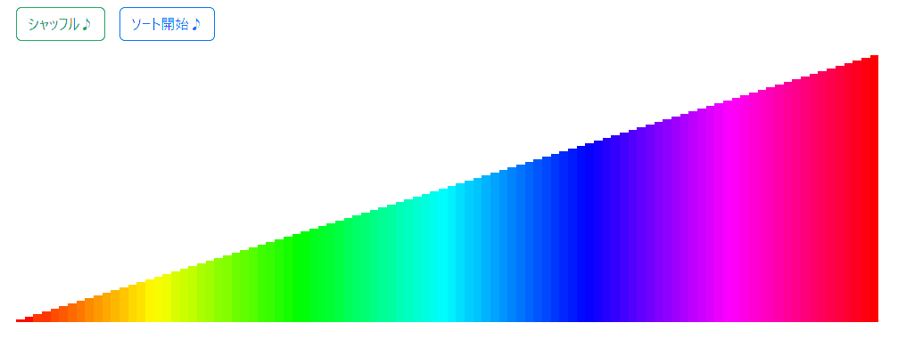
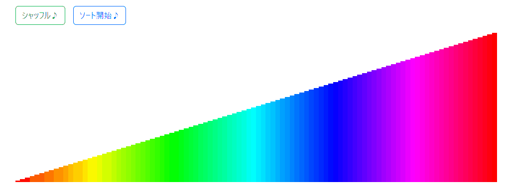
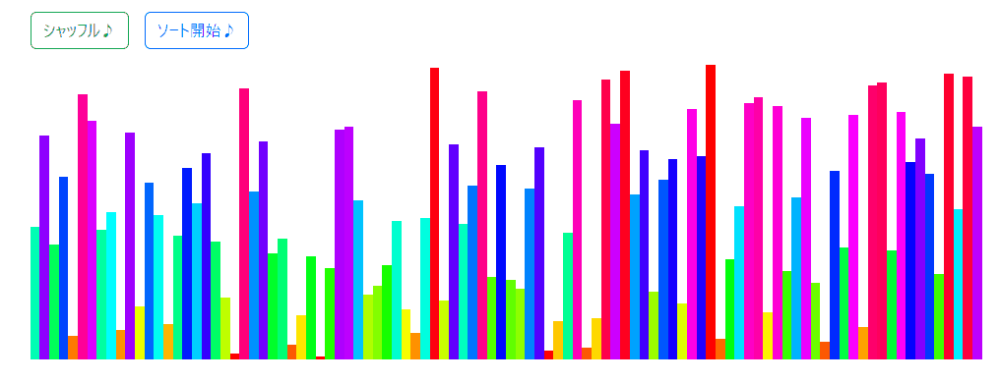
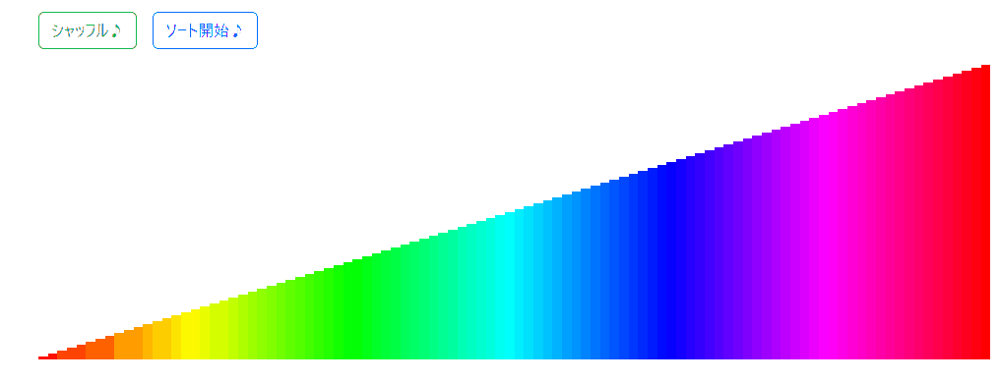

# 整列アルゴリズムデモ

[sorter-demo](https://github.com/osawa-koki/sorter-demo.ts)より。  

---

## Bubble Sort

  

## Selection Sort

  

## Insertion Sort

  

## Merge Sort

  

## Quick Sort

  

## Heap Sort

  

## Counting Sort

  

## Bucket Sort

  

## Shell Sort

  

## Comb Sort

  

## Cycle Sort

  

## Pancake Sort

  

## Gnome Sort

  

## Stooge Sort

  

## Pigeonhole Sort

  

## Odd-Even Sort

  

## Cocktail Sort

  

## Sleep Sort

  

## Strand Sort

  
